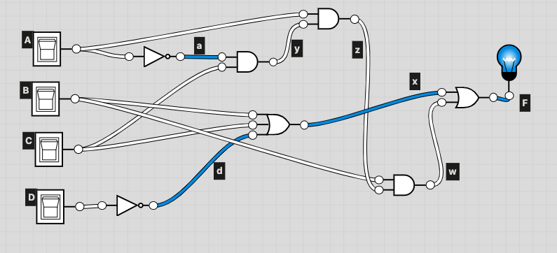
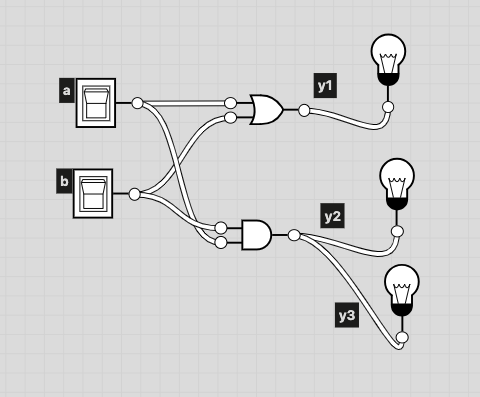
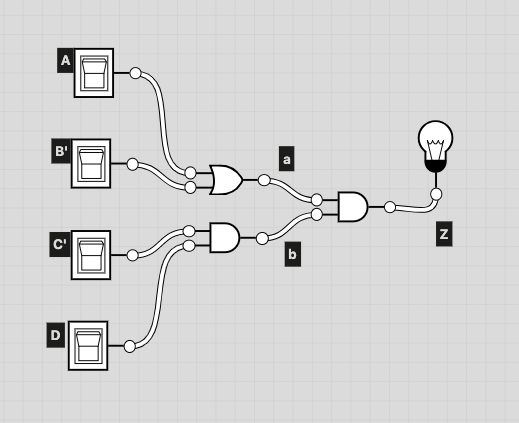
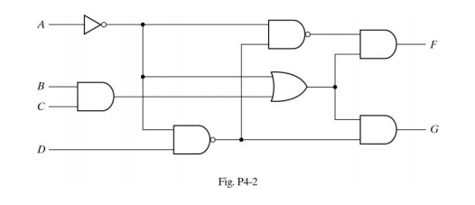

# CSC 346
## Homework 4
### Matthew Connelly
### 4/10/19

1. Draw the logic diagram of the digit circuit specified by the following Verilog description:
(a)
	```
	module Circuit_A (A, B, C, D, F);
		input A, B, C, D;
		output F;
		wire w, x, y, z, a, d;
		or (x, B, C, d);
		and (y, a ,C);
		and (w, z ,B);
		and (z, y, A);
		or (F, x, w);
		not (a, A);
		not (d, D);
	endmodule
	```
;

\newpage

(b)
	```
	module Circuit_B (y1, y2, y3, a, b);
		output y1, y2, y3;
		input a, b;
		assign y1 = a || b;
		and (y2, a, b);
		assign y3 = a && b;
	endmodule
	```



\newpage

2.
(a) Write a Verilog description of the circuit shown below 
	```
	module Circuit(F, A, A_bar, B, B_bar, C, D_bar);
		output F;
		input A, A_bar, B, B_bar, C, D_bar;
		wire a,b,c,d;

		and(a, A, B_bar);
		and(b, A_bar, B);
		or(d, a, b);

		or(c, C, D_bar);

		and(F, d, c);
	endmodule;
	```

(b) write a Verilog description of the circuit specified by the following Boolean function:
```
Z = (A + B’)C’(C + D) 
```

\newpage

```
<Simplified>
Z = C'D(A + B')
```

```
module Circuit(Z, A, B_bar, C_bar, D);
	input A, B_bar, C_bar, D;
	output Z;
	wire a, b;

	or(a, A, B_bar);
	and(b, C_bar, D);
	and(Z, a, b);
endmodule
```
\newpage

3. The adder-subtractor has the following values for mode input M and data inputs A and B:

|  | M | A | B |
| - | - | - | - |
| (a) | 0 | 1100 | 1000 |
| (b) | 1 | 0111 | 0110 |
| (c) | 1 | 0000 | 0001 |
| (d) | 0 | 0101 | 1010 |

In each case, determine the values of the SUM outputs, the carry C, and overflow V. 

(a)

	```
	M = 0

	1100
	1000 +
	----
	0100

	C = 1
	V = 1
	```

(b)
	```
	M = 1

	0111
	0110 -

	<2's complement>

	0111
	1010 +
	----
	0001

	C = 1
	V = 0
	```

(c)
	```
	M = 1

	0000
	0001 -

	<2's complement>

	0000
	1111 +
	----
	1111

	C = 0
	V = 0
	```

(d)
	```
	M = 0

	0101
	1010 +
	----
	1111

	C = 0
	V = 0
	```

\newpage

4. Assume that the exclusive-OR gate has a propagation delay of 15ns and that the AND and
OR gates have a propagation delay of 10 ns. (a) What is the propagation delay time of
following 1-bit full adder? (b) what is the total propagation delay time of a 4-bit ripple carry
adder built using the 1-bit full adder? (c) what is the total propagation delay time of a 4 bit
carry lookahead adder? 

(a) 15 + 15 = 30ns (15ns per level)
(b) 30*4 = 120ns (30ns per FA)
(c) 30ns

5. Use Boolean theorems or K-maps to obtain the simplified Boolean expressions for outputs F
and G in terms of the input variables in the following circuit.



**Simplifying F**
```
[ A'(DA')' ]'(BC + A') = F
BCA + DA'BC + DA'
BCA + A'(DBC + D) 
BCA + A'[ D(BC + 1) ]
BCA + A'D 

<Simplified>
BCA + A'D = F
```

**Simplifying G**
```
(DA')'(BC + A') = G

(D' + A)(BC + A')

<As sum of minterms>
ABCD' + A'BCD' + A'B'CD' + A'BC'D' + A'B'C'D' + ABCD
```
| AB\\CD | 00 | 01 | 11 | 10 |
| - | - | - | - | - |
| 00 | 1 | 0 | 0 | 1 |
| 01 | 1 | 0 | 0 | 1 |
| 11 | 0 | 0 | 1 | 1 |
| 10 | 0 | 0 | 0 | 0 |

$\Rightarrow$ `A'D' + BCD' + ABC`
