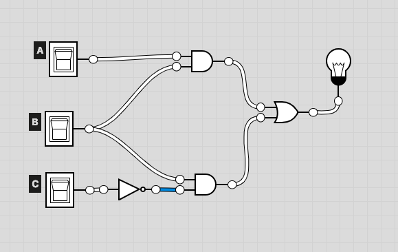
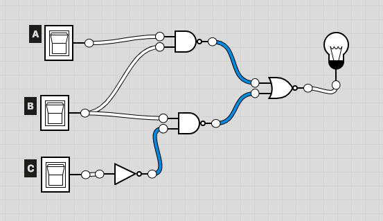
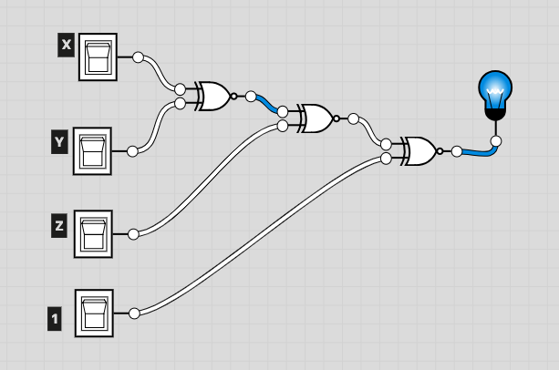
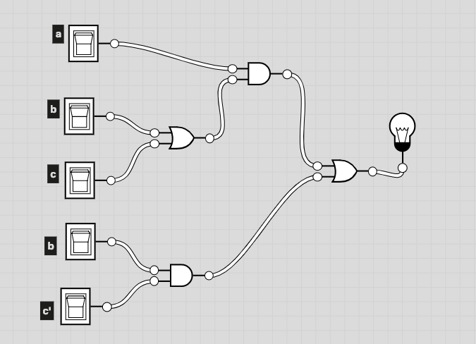
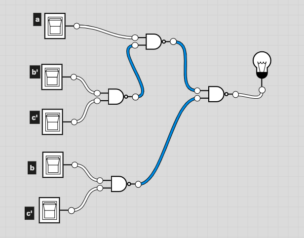

# CSC 347
# Lab 4 - Single Chip Implementation
# Matthew Connelly
# March 18, 2019

\newpage

# Goals 
To design, minimize and implement a logic function using a single chip.

# Design Procedure / Theory of Operations  
First, we we had to implement the function F = AB + BC' using all NAND gates. From this function the following truth table was derived:

| A | B | C | F | 
| - | - | - | - | 
| 0 | 0 | 0 | 0 | 
| 0 | 0 | 1 | 0 | 
| 0 | 1 | 0 | 1 | 
| 0 | 1 | 1 | 0 | 
| 1 | 0 | 0 | 0 | 
| 1 | 0 | 1 | 0 | 
| 1 | 1 | 0 | 1 | 
| 1 | 1 | 1 | 1 | 

Using AND, OR and NOT gates, F can be represented with the following circuit diagram:

\newpage

Below, the circuit diagram of F after being converted to an all NAND gates implementation:

The second circuit we needed to build was a 3-bit odd parity generator, represented by function P. The boolean function P, using XOR gates only, and its derived truth table were as follows:

$$
	P = (X \oplus Y \oplus Z)'
$$

| X | Y | Z | P | 
| - | - | - | - | 
| 0 | 0 | 0 | 1 | 
| 0 | 0 | 1 | 0 | 
| 0 | 1 | 0 | 0 | 
| 0 | 1 | 1 | 1 | 
| 1 | 0 | 0 | 0 | 
| 1 | 0 | 1 | 1 | 
| 1 | 1 | 0 | 1 | 
| 1 | 1 | 1 | 0 | 

\newpage

P's logic diagram:

\newpage

# Homework

For homework, we had to draw the NAND gate representation of the function

$$
F = a(b + c) + bc'
$$

\newpage

In an all-NAND gate representation:

