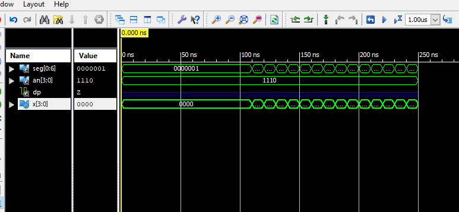

# CSC 347
# Lab 8 - Binary to Seven-Segment Decoder
# Matthew Connelly
# April 16, 2019

\newpage

# Goals 
The goal of this lab was to display a 4-bit binary number on a 7-segment display using the Verilog HDL and a Basys board. For a single digit, the number ranged from 0 to 9, and then from hexadecimal A to F.

# Design Procedure / Theory of Operations  
We were given the following diagram of a seven-segment digit:
```
   a
  ---
f| g |b
  ---
e| d |c
  ---
```
Symbols a - g represent the segments that will be turned on and off using active low (0 to set) inputs to represent a single digit. The following truth table was derived for these outputs:

| x | abcdefg |
| - | - |
| 0000  | 0000001 |
| 0001  | 1001111 |
| 0010  | 0010010 |
| 0011  | 0000110 |
| 0100  | 1001100 |
| 0101  | 0100100 |
| 0110  | 0100000 |
| 0111  | 0001111 |
| 1000  | 0000000 |
| 1001  | 0001100 |
| 1010  | 0001000 |
| 1011  | 1100000 |
| 1100  | 0110000 |
| 1101  | 1000010 |
| 1110  | 0110000 |
| 1111  | 0111000 |

The following Verilog code was then used to implement the 7 segment decoder behaviorally:

\newpage

```
module bin7seg(x, seg, an, dp);

	input [3:0] x;
	output [0:6] seg;
	output [3:0] an;
	output dp;

	reg [0:6] seg;
	
	assign an = 4'b1110;
	
	
	always @(x)
		case(x)
			0: seg = 7'b0000001;
			1: seg = 7'b1001111;
			2: seg = 7'b0010010;
			3: seg = 7'b0000110;
			4: seg = 7'b1001100;
			5: seg = 7'b0100100;
			6: seg = 7'b0100000;
			7: seg = 7'b0001111;
			8: seg = 7'b0000000;
			9: seg = 7'b0001100;
			10: seg = 7'b0001000;
			11: seg = 7'b1100000;
			12: seg = 7'b0110001;
			13: seg = 7'b1000010;
			14: seg = 7'b0110000;
			15: seg = 7'b0111000;

	endcase

endmodule
```

We then used a Verilog test bench Test Fixture to test the decoder, which output the following waves:

\newpage



Reading these waves, we verified the accuracy of our programs.

Lastly, we flashed the Baysys board with a test program to see the display in action. Exhausting all possible combinations of switches, we could verify in practice the efficacy of our program.
