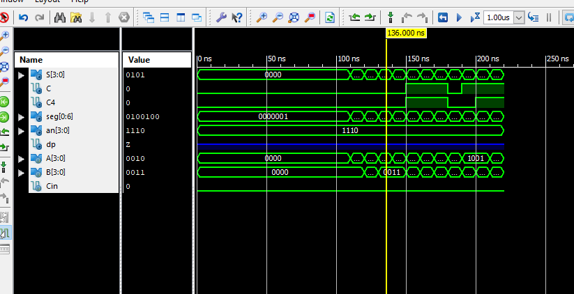

# CSC 347
# Lab 9 - BCD Adder
# Matthew Connelly
# April 30, 2019

\newpage

# Goals 
The goal of this lab was to build a BCD adder using binary adders and display the result with a 7-segment decoder, written in Verilog HDL.

# Design Procedure / Theory of Operations
Using Verilog, we wrote the code for a 4-bit binary adder: 

```
module BinaryAdder (Sum, Cout, A, B, Cin);
	input [3:0] A, B;
	input Cin;
	output [3:0] Sum;
	output Cout;

	assign {Cout, Sum} = A + B + Cin;
endmodule
```

This module would later be called in the full `BCDAdder` module. We then needed the 7-segment decoder code:

\newpage

```
module bin7seg(S, seg, an, dp);

	input [3:0] S;
	output [0:6] seg;
	output [3:0] an;
	output dp;

	reg [0:6] seg;
	
	assign an = 4'b1110;
	
	
	always @(S)
		case(S)
			0: seg = 7'b0000001;
			1: seg = 7'b1001111;
			2: seg = 7'b0010010;
			3: seg = 7'b0000110;
			4: seg = 7'b1001100;
			5: seg = 7'b0100100;
			6: seg = 7'b0100000;
			7: seg = 7'b0001111;
			8: seg = 7'b0000000;
			9: seg = 7'b0001100;
			10: seg = 7'b0001000;
			11: seg = 7'b1100000;
			12: seg = 7'b0110000;
			13: seg = 7'b1000010;
			14: seg = 7'b0110000;
			15: seg = 7'b0111000;

	endcase

endmodule

```

The `BCDAdder` module calls both of the above modules as seen below:

\newpage

```
module BCDAdder(S, C, A, B, Cin, C4, seg, an, dp);
	input [3:0] A, B;           // two inputs
	input  Cin;                     // carry in  
	output  [3:0] S;             // sum
	// C indicates if binary sum is > 9. C4 is the carry out of the bottom adder
	output  C, C4;               
	output [0:6] seg;          // segments a, b, c, d, e, f , g     
	output [3:0] an;           // anode to enable display    
	output dp;                    // decimal point      

	// K is the carry output of the top adder
	//  X is the left input of the bottom adder, i.e, 0000 or 0110. Z is the 
    //  right input of the bottom adder

	wire K;
	wire [3:0] Z, X;
                         
   // calculate the output Carry C based on the circuit for detecting if Z > 9
	assign C = K | (Z[3] & Z[2]) | (Z[3] & Z[1]);
	
   // fill in X using C : X = 0000 or 0110
	assign X[0] = 0;
	assign X[3] = 0;
	assign X[1] = C;
	assign X[2] = C;

                          // call BinaryAdder (set Cin=0 for the bottom 4-bit adder) twice and bin7seg 
	BinaryAdder U1(Z,K,A,B,Cin);
	BinaryAdder U2(S,C4,Z,X,0);
	bin7seg U3(S, seg, an, dp);
endmodule  
```

Following the completion of the BCD adder module, a testbench was made to make sure the module worked correctly. Several waves were generated and analyzed:

\newpage 



Finally, the program was flashed to the Baysys board where we tested the program's efficacy by manually testing inputs (via switches) and arithmetic and observing the 7-segment display's readout.
