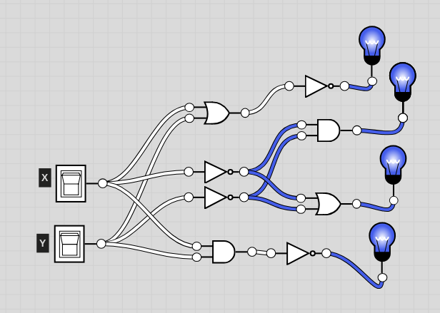

# CSC 347
# Lab 2 - DeMorgan's Theorem
# Matthew Connelly
# February 26, 2019

\newpage

# Goals 
The goal of Lab 2 was to prove DeMorgan's Laws, which state the following:
$$
(x + y)' = x' y'
$$
and
$$
(xy)' = x' + 'y
$$
These laws tell us what the complement of an expression will be equal to. More generally:
$$
(x \odot y) = x' \odot' y'
$$
Where $\odot$ can be either AND or OR. This demonstrates the inversion of a binary operator in this closed group.

To prove DeMorgan's law, we first derived a truth table and then constructed a circuit.

The circuit was constructed with the following components:

- 74HCT08 AND gate
- 74HCT32 OR gate
- 74HCT04 inverter gate

Input and output was tested via switches and LED lights, respectively.

# Design Procedure / Theory of Operations  

The equations that comprise DeMorgan's Laws will be expressed as follows:

$$
(x + y)' = x' y'
$$
$$
\Rightarrow F1 = F2
$$
and
$$
(xy)' = x' + 'y
$$
$$
\Rightarrow F3 = F4
$$

From these Laws, the table below was derived:
```
xy | F1=(x+y)' | F2=x'y' | F3=(xy)' | F4=x'+y'
00		1			1			1		1
01 		0			0			1		1
10		0			0			1		1
11		0			0			0		0

```
This table outlines the inputs and outputs for each individual gate and shows plainly that $F1=F2$ and $F3=F4$ are both true, verifying DeMorgan's Laws in theory.

Several logic gates were then connected to two inputs on a breadboard as detailed in the circuit diagram below:



The switches x and y were then set to match each row in the xy column in the above table, and the outputs were verified by a lit LED for 1 and off LED for 0.

# Conclusion
DeMorgan's Laws hold true, both in theory and analog implementation. This also demonstrates that the result of a boolean algebraic expression will be the same in an analog implementation (circuit design).
